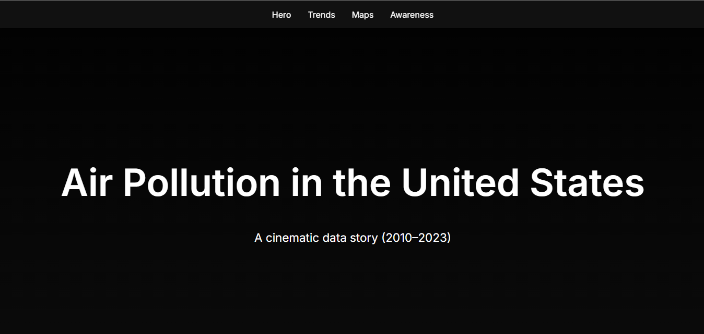
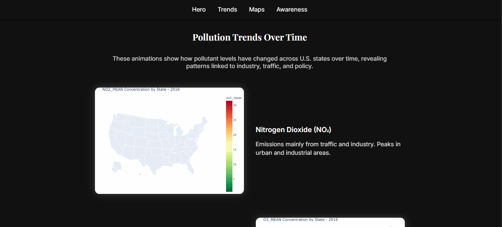
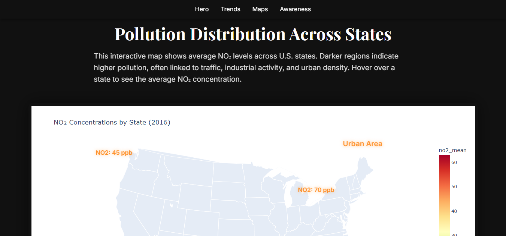
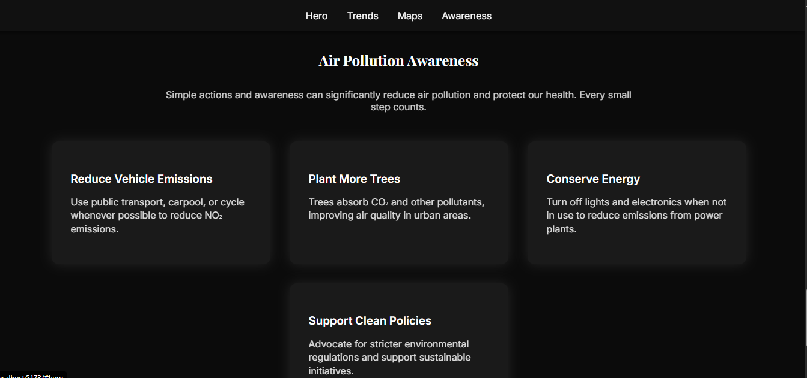

# Air Pollution Cinematic WebApp

A **cinematic, interactive web application** visualizing air pollution trends across the United States (2010–2023). Built with **React + Vite**, it features animated pollutant trends, an interactive state-level NO₂ map, and actionable awareness tips to promote clean air practices.

---

## Features

- **Hero Section:** Fullscreen cinematic introduction with smooth fade-in animation.
- **Pollution Trends:** Animated GIFs showing Nitrogen Dioxide (NO₂) and Ozone (O₃) trends across the U.S.
- **Interactive Map:** State-level NO₂ concentration choropleth with floating labels highlighting urban hotspots.
- **Awareness Tips:** Easy-to-read cards providing actionable steps to reduce air pollution.
- **Responsive Design:** Fully functional on desktop, tablet, and mobile screens.
- **Footer:** Clean social links and copyright notice with subtle animations.

---

## Screenshots

  
  
  
  


---

## Technologies Used

- **React** – UI Library
- **Vite** – Build tool and dev server with fast refresh
- **Framer Motion** – Smooth animations
- **Plotly / HTML Iframes** – Interactive choropleth map visualizations
- **CSS / Flexbox** – Layout and responsive design
- **GIFs** – Animated pollution trends

---

## Project Structure

src/
├─ assets/
│ ├─ gifs/ # Animated pollutant trend GIFs
│ └─ images/ # Supporting images/icons
├─ components/ # Reusable components like FloatingData
├─ sections/
│ ├─ Hero.jsx
│ ├─ Trends.jsx
│ ├─ Maps.jsx
│ ├─ Awareness.jsx
│ └─ Footer.jsx
├─ App.jsx
└─ main.jsx

---

## Getting Started

### Prerequisites

- Node.js (v18+ recommended)
- npm or yarn

### Installation

```bash
# Clone the repository
git clone https://github.com/your-username/air-pollution-cinematic-webapp.git

# Navigate into the project folder
cd air-pollution-cinematic-webapp

# Install dependencies
npm install
# or
yarn
# Start development server
npm run dev
# or
yarn dev
Open http://localhost:5173
 in your browser. The app supports HMR for instant updates.

### Usage Notes

The Map Section relies on local HTML files generated by Plotly (choropleth_no2_states_2016.html). Ensure these files are located in public/maps/.
Trend GIFs should be stored in src/assets/gifs/.
You can customize floating labels on the map by editing FloatingData.jsx and Maps.jsx.

### Future Improvements

Add additional pollutants (SO₂, CO, PM2.5) with animated trends.
Add interactive filtering by year or pollutant type.
Include cinematic background effects or particle animations.
Enhance accessibility and ARIA support.

### License

This project is open-source and available under the MIT License.

